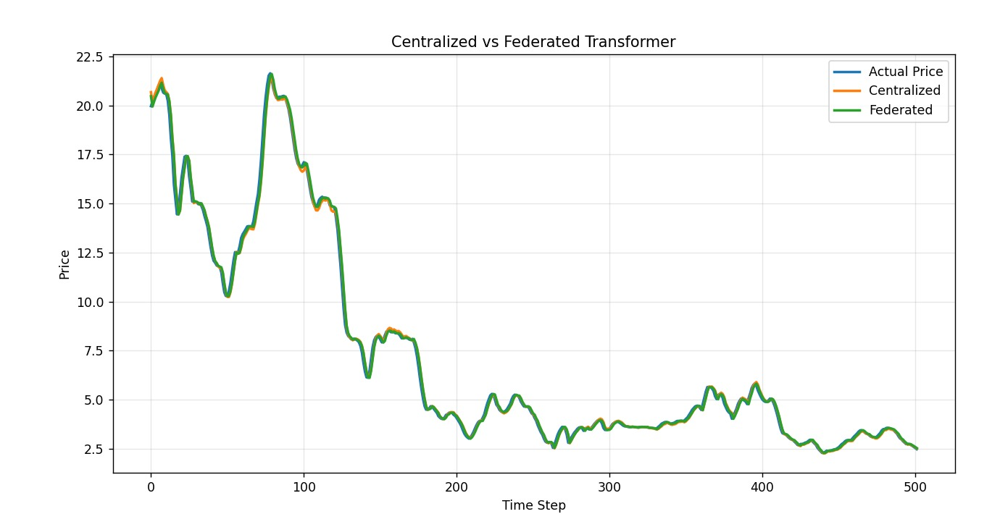

# 📈 Stock Price Prediction using Transformer & Federated Learning

 **Live Demo:** https://yashika-stock-prediction.streamlit.app/
 A privacy-preserving deep learning framework for financial forecasting using Transformer architecture and Federated Averaging (FedAvg) — tested on real Indian stock market data.

 **Abstrac**t:
This project presents a comparative study of **Centralized** and **Federated Learning** approaches for stock price prediction using a custom **Transformer-based deep learning model**. Traditional centralized models require sharing raw financial data across institutions — raising serious data privacy concerns. This work addresses that limitation by implementing **Federated Averaging (FedAvg)**, enabling multiple clients to collaboratively train a shared model without exposing their raw data.

The model is evaluated on both a **single dataset** (sample stock) and a **multi-dataset** setup using real Indian equities — **Infosys (INFY)**, **Reliance Industries (RELIANCE)**, and **Tata Consultancy Services (TCS)**. Results demonstrate that the federated model achieves **comparable or superior performance** to the centralized baseline, with an R² score of **0.9976** and MAPE of **2.4%** — validating that privacy-preserving training does not significantly sacrifice predictive accuracy.


**Key Contributions**:

- Custom **Transformer architecture** with positional embeddings for time-series forecasting
- Implementation of **Federated Averaging (FedAvg)** across multiple simulated clients
- Comparative evaluation: Centralized vs. Federated across single and multi-stock datasets
- Feature engineering pipeline: log returns, moving averages, volatility, momentum
- Noise reduction using **Savitzky-Golay filter** on OHLC data
- Directional accuracy evaluation for real-world trading signal utility


## Result:

### Single Dataset


| Model | MSE | RMSE | MAE | MAPE | R² | Directional Accuracy |
|-------|-----|------|-----|------|----|----------------------|
| Centralized Transformer | 0.0757 | 0.2751 | 0.1734 | 2.51% | 0.9975 | 53.19% |
| **Federated Transformer** | **0.0719** | **0.2682** | **0.1669** | **2.41%** | **0.9976** | **56.18%** |

> ✅ Federated model outperforms centralized on all key metrics in single-dataset setting.


### Multi-Dataset (Infosys, Reliance, TCS)

#### Centralized Model

| Stock | RMSE | MAE | R² | Directional Accuracy |
|-------|------|-----|----|----------------------|
| Infosys | 3.4769 | 2.5170 | 0.9894 | 52.44% |
| Reliance | 0.3656 | 0.2216 | 0.9957 | 50.10% |
| TCS | 8.1146 | 6.2466 | 0.9769 | 53.66% |

#### Federated Model

| Stock | RMSE | MAE | R² | Directional Accuracy |
|-------|------|-----|----|----------------------|
| Infosys | 3.4573 | 2.5692 | 0.9895 | 47.56% |
| Reliance | 0.3682 | 0.2180 | 0.9956 | 55.67% |
| TCS | 8.4267 | 6.6181 | 0.9750 | 46.34% |

> 📌 **Note on Directional Accuracy:** DA scores of 50–56% are consistent with findings in financial forecasting literature. Market price movements contain inherent randomness (efficient market behaviour), and DA is known to be a harder metric than RMSE/R². Future work will explore incorporating sentiment data and macro indicators to improve signal detection.

---

## 📉 Prediction Graphs

### Single Dataset — Centralized vs Federated


### Multi-Dataset — Infosys, Reliance, TCS


---

## 🛠️ Tech Stack

| Category | Tools |
|----------|-------|
| Language | Python 3.9+ |
| Deep Learning | TensorFlow 2.x, Keras |
| Data Processing | Pandas, NumPy |
| Signal Processing | SciPy (Savitzky-Golay filter) |
| Evaluation Metrics | Scikit-learn |
| Visualization | Matplotlib, Seaborn |
| Federated Learning | Custom FedAvg implementation |

---

## 🗂️ Project Structure

```
stock-prediction-transformer-federated/
│
├── single_dataset.py          # Transformer model — single stock dataset
├── multi_dataset.py           # Transformer model — multi-stock federated setup
│
├── results/
│   ├── single_dataset_graph.jpeg
│   └── multi_dataset_graph.png
│
├── data/
│   └── README.md              # Dataset description (raw CSVs not included)
│
├── requirements.txt
└── README.md
```

---

## ⚙️ How to Run

### 1. Clone the repository

```bash
git clone https://github.com/yashika190/stock-prediction-transformer-federated.git
```

### 2. Install dependencies

```bash
pip install -r requirements.txt
```

### 3. Prepare your dataset

Place your stock CSV file in the project root. The CSV must contain these columns:

```
Date, Open, High, Low, Close, Volume
```

### 4. Run single dataset experiment

```bash
python single_dataset.py
```

### 5. Run multi-dataset federated experiment

Update the file paths in `multi_dataset.py`:

```python
df1 = load_data("your_stock1.csv")
df2 = load_data("your_stock2.csv")
df3 = load_data("your_stock3.csv")
```

Then run:

```bash
python multi_dataset.py
```

---

## 📦 Requirements

```
tensorflow>=2.10
numpy
pandas
scikit-learn
matplotlib
seaborn
scipy
```

Install all at once:

```bash
pip install tensorflow numpy pandas scikit-learn matplotlib seaborn scipy
```

---

## 🧠 Model Architecture

```
Input (50 timesteps × 7 features)
        ↓
  Dense Projection (d_model = 128/256)
        ↓
  Positional Embedding
        ↓
  ┌─────────────────────────────┐
  │  Transformer Block × 2–3   │
  │  ┌─────────────────────┐   │
  │  │ Multi-Head Attention │   │
  │  │   (4 heads)         │   │
  │  └─────────────────────┘   │
  │          + Dropout          │
  │     Layer Normalization     │
  │  ┌─────────────────────┐   │
  │  │  Feed Forward (FFN) │   │
  │  │  ReLU + Dropout     │   │
  │  └─────────────────────┘   │
  │     Layer Normalization     │
  └─────────────────────────────┘
        ↓
  Global Average Pooling
        ↓
      Dropout
        ↓
   Dense Output (1 neuron)
        ↓
  Predicted Return / Price
```

---

## 🔒 Federated Learning Setup

```
Global Model (Server)
       ↓ broadcast weights
  ┌────┬────┬────┬────┬────┐
Client1 Client2 Client3 Client4 Client5
  (local training on private data)
  └────┴────┴────┴────┴────┘
       ↓ send local weights
  Federated Averaging (FedAvg)
  weighted avg by dataset size
       ↓
  Updated Global Model
  (repeat for N rounds)
```

- **Clients:** 5 (single dataset) / 3 stocks (multi-dataset)
- **Rounds:** 70 (single) / 25 (multi)
- **Local epochs per round:** 3 (single) / 2 (multi)
- **Aggregation:** Weighted FedAvg

---

## 📚 Research Context

This project is part of an MCA (Master of Computer Applications) research project exploring the intersection of:

- **Privacy-Preserving Machine Learning** — Federated Learning as an alternative to raw data sharing
- **Transformer Models for Time Series** — adapting NLP architectures for financial forecasting
- **Indian Stock Market Analysis** — applying deep learning to NSE-listed equities

**Future work:**
- Incorporate sentiment analysis (news + social media)
- Add macroeconomic indicators (interest rates, inflation)
- Experiment with differential privacy for stronger guarantees
- Test on larger multi-market datasets

---

## 👩‍💻 Author

**[Yashika Seth]**
MCA 4th Semester | Computer Science
[Guru Nanak Dev College , Jalandhar ]

📧 [yashikaseth2611@gmail.com]
🔗 [(https://www.linkedin.com/in/yashika-seth-914b59292)]

---

## 📄 License

This project is licensed under the MIT License — see the [LICENSE](LICENSE) file for details.

---

> ⭐ If you found this project useful or interesting, please consider giving it a star!
